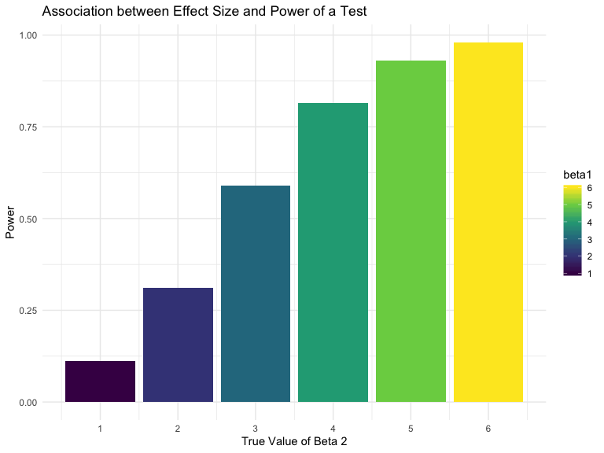

HW 5
================
Clement Mugenzi
11/6/2019

# Problem 1

This is the code chunk that introduces missing data in the **iris**
dataset.

``` r
iris_with_missing = iris %>% 
  map_df(~replace(.x, sample(1:150, 20), NA)) %>%
  mutate(Species = as.character(Species))
```

## Writing the Function

I will then create a function that will replace missing numeric values
by the mean of that particular variable and also this function will
replace missing character values with the the species **virginica**.

``` r
missingness = function(x) {
  if (!is.numeric(x)) {
    replace(x, is.na(x), "virginica")
  } else if (is.numeric(x)) {
  replace(x, is.na(x), mean(x, na.rm = TRUE))
  }
}
```

``` r
iris1 = 
  map_df(.x = iris_with_missing, ~ missingness(.x)) %>% 
  knitr::kable()
iris1
```

| Sepal.Length | Sepal.Width | Petal.Length | Petal.Width | Species    |
| -----------: | ----------: | -----------: | ----------: | :--------- |
|     5.100000 |    3.500000 |     1.400000 |    0.200000 | setosa     |
|     4.900000 |    3.000000 |     1.400000 |    0.200000 | setosa     |
|     4.700000 |    3.200000 |     1.300000 |    0.200000 | setosa     |
|     4.600000 |    3.100000 |     1.500000 |    1.192308 | setosa     |
|     5.000000 |    3.600000 |     1.400000 |    0.200000 | setosa     |
|     5.400000 |    3.900000 |     1.700000 |    0.400000 | setosa     |
|     5.819231 |    3.400000 |     1.400000 |    0.300000 | setosa     |
|     5.000000 |    3.400000 |     1.500000 |    0.200000 | setosa     |
|     4.400000 |    2.900000 |     1.400000 |    0.200000 | setosa     |
|     4.900000 |    3.100000 |     3.765385 |    0.100000 | setosa     |
|     5.400000 |    3.075385 |     1.500000 |    0.200000 | setosa     |
|     4.800000 |    3.400000 |     1.600000 |    0.200000 | setosa     |
|     5.819231 |    3.075385 |     1.400000 |    0.100000 | setosa     |
|     4.300000 |    3.000000 |     3.765385 |    0.100000 | setosa     |
|     5.819231 |    4.000000 |     3.765385 |    0.200000 | setosa     |
|     5.700000 |    4.400000 |     1.500000 |    0.400000 | setosa     |
|     5.400000 |    3.900000 |     1.300000 |    0.400000 | setosa     |
|     5.100000 |    3.500000 |     1.400000 |    1.192308 | setosa     |
|     5.700000 |    3.800000 |     1.700000 |    0.300000 | setosa     |
|     5.100000 |    3.800000 |     1.500000 |    1.192308 | setosa     |
|     5.400000 |    3.400000 |     1.700000 |    0.200000 | setosa     |
|     5.100000 |    3.700000 |     1.500000 |    0.400000 | virginica  |
|     4.600000 |    3.600000 |     1.000000 |    0.200000 | setosa     |
|     5.819231 |    3.300000 |     3.765385 |    0.500000 | setosa     |
|     4.800000 |    3.400000 |     1.900000 |    0.200000 | virginica  |
|     5.000000 |    3.000000 |     3.765385 |    0.200000 | setosa     |
|     5.000000 |    3.400000 |     1.600000 |    0.400000 | virginica  |
|     5.200000 |    3.500000 |     1.500000 |    0.200000 | setosa     |
|     5.819231 |    3.400000 |     1.400000 |    0.200000 | setosa     |
|     4.700000 |    3.200000 |     1.600000 |    0.200000 | setosa     |
|     4.800000 |    3.100000 |     3.765385 |    0.200000 | setosa     |
|     5.400000 |    3.075385 |     1.500000 |    0.400000 | setosa     |
|     5.200000 |    3.075385 |     1.500000 |    0.100000 | setosa     |
|     5.500000 |    4.200000 |     1.400000 |    0.200000 | setosa     |
|     4.900000 |    3.100000 |     3.765385 |    0.200000 | setosa     |
|     5.000000 |    3.200000 |     1.200000 |    0.200000 | setosa     |
|     5.500000 |    3.500000 |     1.300000 |    0.200000 | setosa     |
|     4.900000 |    3.600000 |     1.400000 |    0.100000 | setosa     |
|     4.400000 |    3.000000 |     1.300000 |    1.192308 | setosa     |
|     5.100000 |    3.400000 |     1.500000 |    0.200000 | setosa     |
|     5.000000 |    3.500000 |     1.300000 |    0.300000 | setosa     |
|     4.500000 |    3.075385 |     1.300000 |    1.192308 | virginica  |
|     4.400000 |    3.200000 |     1.300000 |    0.200000 | setosa     |
|     5.000000 |    3.500000 |     1.600000 |    0.600000 | setosa     |
|     5.100000 |    3.800000 |     1.900000 |    0.400000 | setosa     |
|     4.800000 |    3.000000 |     1.400000 |    0.300000 | virginica  |
|     5.100000 |    3.800000 |     1.600000 |    0.200000 | setosa     |
|     4.600000 |    3.200000 |     3.765385 |    0.200000 | setosa     |
|     5.300000 |    3.700000 |     1.500000 |    0.200000 | setosa     |
|     5.000000 |    3.075385 |     1.400000 |    0.200000 | setosa     |
|     7.000000 |    3.075385 |     4.700000 |    1.400000 | virginica  |
|     6.400000 |    3.200000 |     4.500000 |    1.500000 | versicolor |
|     6.900000 |    3.100000 |     4.900000 |    1.500000 | versicolor |
|     5.500000 |    2.300000 |     4.000000 |    1.300000 | versicolor |
|     6.500000 |    2.800000 |     4.600000 |    1.500000 | versicolor |
|     5.700000 |    2.800000 |     4.500000 |    1.300000 | versicolor |
|     6.300000 |    3.300000 |     4.700000 |    1.600000 | virginica  |
|     4.900000 |    2.400000 |     3.765385 |    1.000000 | versicolor |
|     6.600000 |    2.900000 |     4.600000 |    1.300000 | virginica  |
|     5.200000 |    2.700000 |     3.900000 |    1.400000 | versicolor |
|     5.000000 |    2.000000 |     3.765385 |    1.000000 | versicolor |
|     5.900000 |    3.000000 |     4.200000 |    1.500000 | versicolor |
|     6.000000 |    2.200000 |     4.000000 |    1.192308 | versicolor |
|     6.100000 |    2.900000 |     4.700000 |    1.400000 | versicolor |
|     5.600000 |    2.900000 |     3.600000 |    1.300000 | versicolor |
|     6.700000 |    3.100000 |     4.400000 |    1.400000 | versicolor |
|     5.600000 |    3.000000 |     4.500000 |    1.500000 | versicolor |
|     5.800000 |    3.075385 |     4.100000 |    1.000000 | versicolor |
|     6.200000 |    2.200000 |     4.500000 |    1.500000 | versicolor |
|     5.600000 |    2.500000 |     3.900000 |    1.100000 | versicolor |
|     5.900000 |    3.200000 |     4.800000 |    1.800000 | versicolor |
|     5.819231 |    2.800000 |     4.000000 |    1.300000 | virginica  |
|     6.300000 |    2.500000 |     4.900000 |    1.500000 | versicolor |
|     5.819231 |    2.800000 |     3.765385 |    1.200000 | versicolor |
|     6.400000 |    2.900000 |     4.300000 |    1.300000 | versicolor |
|     6.600000 |    3.000000 |     4.400000 |    1.400000 | versicolor |
|     6.800000 |    2.800000 |     4.800000 |    1.400000 | versicolor |
|     6.700000 |    3.075385 |     5.000000 |    1.192308 | versicolor |
|     6.000000 |    3.075385 |     4.500000 |    1.192308 | versicolor |
|     5.700000 |    2.600000 |     3.500000 |    1.000000 | virginica  |
|     5.500000 |    2.400000 |     3.800000 |    1.100000 | versicolor |
|     5.819231 |    2.400000 |     3.700000 |    1.000000 | versicolor |
|     5.800000 |    2.700000 |     3.900000 |    1.200000 | versicolor |
|     6.000000 |    2.700000 |     5.100000 |    1.600000 | versicolor |
|     5.400000 |    3.000000 |     4.500000 |    1.500000 | versicolor |
|     5.819231 |    3.400000 |     4.500000 |    1.600000 | versicolor |
|     6.700000 |    3.100000 |     4.700000 |    1.192308 | versicolor |
|     5.819231 |    3.075385 |     4.400000 |    1.300000 | versicolor |
|     5.600000 |    3.000000 |     3.765385 |    1.192308 | versicolor |
|     5.500000 |    2.500000 |     4.000000 |    1.192308 | versicolor |
|     5.500000 |    3.075385 |     4.400000 |    1.200000 | versicolor |
|     5.819231 |    3.075385 |     4.600000 |    1.192308 | versicolor |
|     5.800000 |    3.075385 |     4.000000 |    1.192308 | versicolor |
|     5.000000 |    2.300000 |     3.300000 |    1.192308 | virginica  |
|     5.819231 |    2.700000 |     4.200000 |    1.300000 | versicolor |
|     5.700000 |    3.000000 |     4.200000 |    1.200000 | versicolor |
|     5.700000 |    2.900000 |     4.200000 |    1.300000 | versicolor |
|     6.200000 |    2.900000 |     4.300000 |    1.300000 | versicolor |
|     5.100000 |    2.500000 |     3.000000 |    1.192308 | versicolor |
|     5.700000 |    2.800000 |     4.100000 |    1.300000 | virginica  |
|     6.300000 |    3.075385 |     3.765385 |    2.500000 | virginica  |
|     5.800000 |    2.700000 |     5.100000 |    1.900000 | virginica  |
|     7.100000 |    3.000000 |     5.900000 |    2.100000 | virginica  |
|     6.300000 |    2.900000 |     5.600000 |    1.800000 | virginica  |
|     6.500000 |    3.075385 |     5.800000 |    2.200000 | virginica  |
|     7.600000 |    3.000000 |     6.600000 |    2.100000 | virginica  |
|     4.900000 |    2.500000 |     4.500000 |    1.700000 | virginica  |
|     7.300000 |    2.900000 |     6.300000 |    1.800000 | virginica  |
|     6.700000 |    3.075385 |     3.765385 |    1.800000 | virginica  |
|     5.819231 |    3.600000 |     3.765385 |    2.500000 | virginica  |
|     6.500000 |    3.200000 |     5.100000 |    2.000000 | virginica  |
|     5.819231 |    2.700000 |     5.300000 |    1.900000 | virginica  |
|     6.800000 |    3.000000 |     5.500000 |    2.100000 | virginica  |
|     5.700000 |    3.075385 |     5.000000 |    2.000000 | virginica  |
|     5.800000 |    2.800000 |     5.100000 |    2.400000 | virginica  |
|     6.400000 |    3.200000 |     5.300000 |    2.300000 | virginica  |
|     6.500000 |    3.000000 |     3.765385 |    1.800000 | virginica  |
|     7.700000 |    3.800000 |     6.700000 |    1.192308 | virginica  |
|     7.700000 |    2.600000 |     6.900000 |    2.300000 | virginica  |
|     6.000000 |    2.200000 |     5.000000 |    1.500000 | virginica  |
|     5.819231 |    3.200000 |     5.700000 |    1.192308 | virginica  |
|     5.600000 |    3.075385 |     4.900000 |    2.000000 | virginica  |
|     7.700000 |    2.800000 |     6.700000 |    2.000000 | virginica  |
|     6.300000 |    2.700000 |     4.900000 |    1.800000 | virginica  |
|     6.700000 |    3.300000 |     5.700000 |    2.100000 | virginica  |
|     7.200000 |    3.200000 |     6.000000 |    1.800000 | virginica  |
|     6.200000 |    2.800000 |     4.800000 |    1.800000 | virginica  |
|     6.100000 |    3.000000 |     4.900000 |    1.800000 | virginica  |
|     6.400000 |    2.800000 |     5.600000 |    2.100000 | virginica  |
|     7.200000 |    3.000000 |     5.800000 |    1.600000 | virginica  |
|     7.400000 |    2.800000 |     6.100000 |    1.192308 | virginica  |
|     7.900000 |    3.800000 |     3.765385 |    2.000000 | virginica  |
|     6.400000 |    2.800000 |     3.765385 |    2.200000 | virginica  |
|     5.819231 |    2.800000 |     5.100000 |    1.500000 | virginica  |
|     6.100000 |    3.075385 |     5.600000 |    1.400000 | virginica  |
|     5.819231 |    3.000000 |     6.100000 |    2.300000 | virginica  |
|     5.819231 |    3.400000 |     5.600000 |    1.192308 | virginica  |
|     6.400000 |    3.100000 |     5.500000 |    1.192308 | virginica  |
|     6.000000 |    3.000000 |     4.800000 |    1.800000 | virginica  |
|     6.900000 |    3.100000 |     5.400000 |    2.100000 | virginica  |
|     6.700000 |    3.100000 |     5.600000 |    2.400000 | virginica  |
|     6.900000 |    3.100000 |     5.100000 |    2.300000 | virginica  |
|     5.819231 |    2.700000 |     5.100000 |    1.900000 | virginica  |
|     6.800000 |    3.200000 |     3.765385 |    2.300000 | virginica  |
|     6.700000 |    3.300000 |     3.765385 |    2.500000 | virginica  |
|     6.700000 |    3.000000 |     5.200000 |    2.300000 | virginica  |
|     6.300000 |    2.500000 |     5.000000 |    1.900000 | virginica  |
|     6.500000 |    3.000000 |     5.200000 |    2.000000 | virginica  |
|     5.819231 |    3.400000 |     5.400000 |    2.300000 | virginica  |
|     5.900000 |    3.000000 |     5.100000 |    1.800000 | virginica  |

# Problem 2

Reading in data and tidying it.

``` r
data_path = "data/" 
files = dir(data_path, pattern = "*.csv") 

data = data_frame(filename = files) %>% 
  mutate(file_contents = map(filename, ~ read_csv(file.path(data_path, .)))) 
data = data %>% 
  unnest() %>% 
  separate(col = filename, into = c("arm", "id")) %>% 
  mutate(
    arm = recode(arm, "con" = "Control", "exp" = "Experimental")) %>% 
  select(id, arm, week_1:week_8)
```

Next, I will build the spaghetting plot showing observations of each
subject overtime.

``` r
data %>%
  pivot_longer(
    week_1:week_8,
    names_to = "week",
    values_to = "observation") %>% 
  ggplot(aes(x = week, y = observation, color = id, group = id)) +
  geom_line() +
  facet_grid(~arm) +
  labs(
    title = "Observation of each Subject Overtime",
    x = "Week",
    y = "Observations")
```


As we move from week\_1 to week\_8, there is an overall plateau trend
(despite within groups fluctuations) in observations of the control
group (suggesting a placebo was administered) and an overall increase in
observations for the intervantion group. Since we are dealing with a
longitidinal study, I suspect the treatment for the variable being
studied here is really efficient (or inefficient) and can safely
conclude that there is a significant difference between the intervention
and control groups at baseline (week\_1) compared to the same groups
after the treatment (week\_8).

``` r
data %>% 
  knitr::kable() %>% head()
```

    ## [1] "id   arm             week_1   week_2   week_3   week_4   week_5   week_6   week_7   week_8"
    ## [2] "---  -------------  -------  -------  -------  -------  -------  -------  -------  -------"
    ## [3] "01   Control           0.20    -1.31     0.66     1.96     0.23     1.09     0.05     1.94"
    ## [4] "02   Control           1.13    -0.88     1.07     0.17    -0.83    -0.31     1.58     0.44"
    ## [5] "03   Control           1.77     3.11     2.22     3.26     3.31     0.89     1.88     1.01"
    ## [6] "04   Control           1.04     3.66     1.22     2.33     1.47     2.70     1.87     1.66"

# Problem 3

I will write a function that simulate data from a simple linear
regression, fit the regression model, and return estimates of the
regression coefficients.

``` r
sim_slr = function(n = 30, beta0 = 2, beta1 = 0){
  
  slr_data = tibble(
    x = rnorm(n, mean = 0, sd = 1),
    y = beta0 + beta1 * x + rnorm(n, 0, sqrt(50))
  )
  
  ls_fit = lm(y ~ x, data = slr_data) %>% 
    broom::tidy() # 95% is the default CI
  
  tibble(
    beta1_hat = ls_fit[[2,2]],
    p_value = ls_fit[[2,5]]
  )
}
```

Now, I will use the **purr** function **rerun** to run a simulation
**10000** times to see the effect of randomness in standard error to the
estimates **beta0\_hat** and **beta1\_hat**.

``` r
slr_10000 = 
  rerun(10000, sim_slr(beta1 = 0)) %>% 
  bind_rows()
```

Let us repeat the above for multiple **beta1**.

``` r
beta1_change = 
  tibble(beta1 = c(1:6)) %>% 
  mutate(
    output_list = map(.x = beta1, ~rerun(10000, sim_slr(beta1 = .x))),
    parameter_df = map(output_list, bind_rows)) %>% 
  select(-output_list) %>% 
  unnest(parameter_df)
```

Let’s now plot the association between effect size and power of a test.

``` r
beta1_change %>% 
  group_by(beta1) %>% 
  summarise(
    n = n(),
    power = sum(p_value < 0.05)/n) %>% 
  ggplot(aes(x = beta1, y = power, fill = beta1)) +
  geom_bar(stat = "identity") + 
  scale_x_continuous(breaks = c(1:6)) +
  labs(
    title = "Association between Effect Size and Power of a Test",
    x = "True Value of Beta 2",
    y = "Power")
```



According to the bar plot, it is clear that as the effect size
increases, the power of a test increases too.

Let’s now make a plot comparing both the average estimates of beta1 hat
for all samples and beta1 hat for just samples where the null hypothesis
was rejected to the true value of
beta1.

``` r
# Average estimates of beta1 hat on the y-axis against true of beta1 value on the
# x-axis.
all_sample_average = 
  beta1_change %>% 
  group_by(beta1) %>% 
  summarise(
    beta1_average = mean(beta1_hat))

# Average estimates of beta1 hat for only samples whose null hypothesis was rejected.
select_samples = 
  beta1_change %>% 
  filter(p_value < 0.05) %>% 
  group_by(beta1) %>% 
  summarise(
    average_beta1_select = mean(beta1_hat))

# Overlayed plots

ggplot() + 
  geom_point(aes(x = beta1, y = beta1_average), data = all_sample_average,
                 color = "red") +
  geom_smooth(aes(x = beta1, y = beta1_average), data = all_sample_average,
                 color = "red") +
  geom_point(aes(x = beta1, y = average_beta1_select), data = select_samples,
                 color = "green") +
  geom_smooth(aes(x = beta1, y = average_beta1_select), data = select_samples,
                 color = "green") +
  scale_x_continuous(breaks = c(1:6)) + 
  scale_color_identity(breaks = c("red", "green"),
                       labels = c("all Samples", "Select Samples"),
                        guide = "legend") +
  labs(
    title = "Mean Estimates of Beta1 hat against true Beta1 Values",
    x = "True Beta1 Values",
    y = "Mean Estimates of Beta1 Hat") 
```

    ## `geom_smooth()` using method = 'loess' and formula 'y ~ x'
    ## `geom_smooth()` using method = 'loess' and formula 'y ~ x'


Thus, when the effect size is small (beta1 = 1), the mean estimate of
beta1 hat for all samples (red line) is significantly different from the
mean estimates of beta1 hat for those samples whose null hypothese was
rejected. But as the effect size increases, meaning as the effect size
approaches beta1 equal 6, mean estimates for both all samples and
samples whose null hypothesis was rejected tend towards being the same
values.
